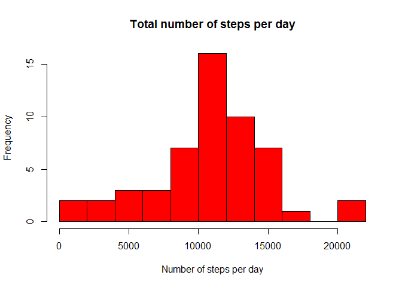
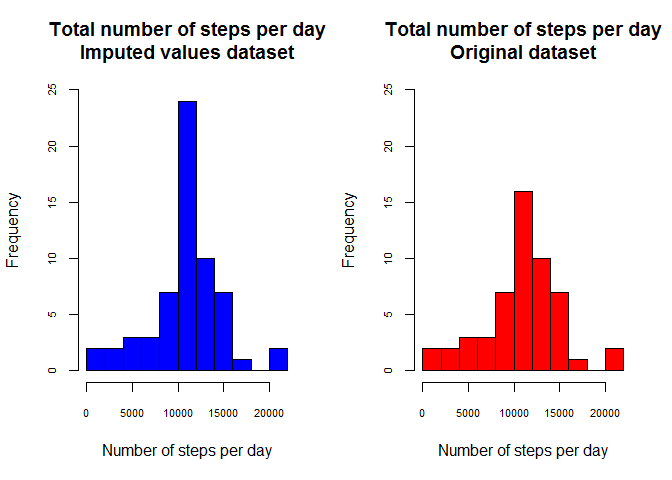
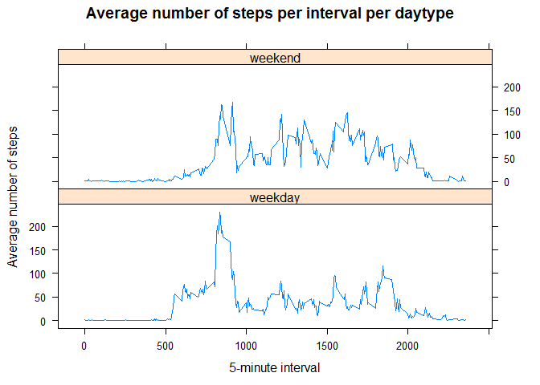

# Reproducible Research: Peer Assessment 1

=========================================================================================

## Introduction

This assignment makes use of data from a personal activity monitoring device. This device collects data at 5 minute intervals through out the day. The data consists of two months of data from an anonymous individual collected during the months of October and November, 2012 and include the number of steps taken in 5 minute intervals each day.  

## Loading and preprocessing the data  
  
After unzipping the file to our working directory, data are read from the csv file.
*date* Variable is casted in appropriate date format as well and the data frame is converted to a *local data frame* after loading `dplyr` package.


```r
data = read.csv("activity.csv",header = T,stringsAsFactors = FALSE)
data$date = as.Date(data$date)
library(dplyr)
data_tbl = tbl_df(data)
```
A quick look at the data:


```r
data_tbl[388:400,]
```

```
## Source: local data frame [13 x 3]
## 
##    steps       date interval
##    (int)     (date)    (int)
## 1      0 2012-10-02      815
## 2      0 2012-10-02      820
## 3      0 2012-10-02      825
## 4      0 2012-10-02      830
## 5      0 2012-10-02      835
## 6      0 2012-10-02      840
## 7      0 2012-10-02      845
## 8      0 2012-10-02      850
## 9      0 2012-10-02      855
## 10     0 2012-10-02      900
## 11     0 2012-10-02      905
## 12     0 2012-10-02      910
## 13     0 2012-10-02      915
```

This hints as how to interpret 5-minute *interval* values: last (at most) 2 digits represent MINUTES, first (at most) 2 digits represent HOURS, with first hour of the day being an impicit 0.  

Some examples:  
  
  - interval 0 reads as interval beginning at 00:00
  - interval 125 reads as interval beginning at 1:25
  - interval 2145 reads as interval beginning at 21:45  
  
I've opted not to coherce *interval* variable into factor or time format as it is pretty usable for analysis and plotting as it is. 
(Factor choice would have raised some issues while plotting continuous lines while POSIX choice was harder to implement while actually bringing no improvement to workflow).    

## What is mean total number of steps taken per day?

A calculation of the total number of steps per day is made:  


```r
steps_by_day = data_tbl%>% 
               group_by(date)%>%
               summarize(total_steps=sum(steps))
```

This is the distribution of steps taken per day:  


```r
hist(steps_by_day$total_steps,breaks=11,
     xlab = "Number of steps per day",
     main = "Total number of steps per day",
     col= "red")
```

 

Mean and median values of this distribution are calculated and reported below:  


```r
avg_steps_by_day = mean(steps_by_day$total_steps,na.rm=TRUE)
med_steps_by_day = median(steps_by_day$total_steps,na.rm=TRUE)
avg_steps_by_day
```

```
## [1] 10766.19
```

```r
med_steps_by_day
```

```
## [1] 10765
```
  

## What is the average daily activity pattern?

A calculation of average number of steps taken per 5-minute time interval (averaged across all days) follows :  


```r
steps_by_interval = data_tbl%>% 
                    group_by(interval)%>%
                    summarize(avg_steps=mean(steps,na.rm=TRUE))
```

Plotting average number of steps against interval:


```r
with(steps_by_interval,plot(interval,avg_steps,type="l",
                            main = "Average number of steps per 5-minute interval",
                            xlab = "5-minute interval",
                            ylab = "Average number of steps"))
```

 

Here we calculate the 5-minute interval with grater number of steps on average across all days:


```r
with(steps_by_interval,interval[which.max(avg_steps)])
```

```
## [1] 835
```

  
## Imputing missing values

A quick summary of data shows we have **2304** missing values in the dataset.  


```r
summary(data_tbl$steps)
```

```
##    Min. 1st Qu.  Median    Mean 3rd Qu.    Max.    NA's 
##    0.00    0.00    0.00   37.38   12.00  806.00    2304
```

We proceed calculating a boolean vector that will be useful for data imputation afterwards. Summing values in it confirms the number the summary has shown us.


```r
NAs = (is.na(data_tbl$steps))
sum(NAs)
```

```
## [1] 2304
```
  

Based on previous total steps per day analysis, we can see we have entire days whose values are missing: 


```r
steps_by_day[is.na(steps_by_day$total_steps),]
```

```
## Source: local data frame [8 x 2]
## 
##         date total_steps
##       (date)       (int)
## 1 2012-10-01          NA
## 2 2012-10-08          NA
## 3 2012-11-01          NA
## 4 2012-11-04          NA
## 5 2012-11-09          NA
## 6 2012-11-10          NA
## 7 2012-11-14          NA
## 8 2012-11-30          NA
```

So imputing missing values via same day's mean/median is no option. I've opted to **impute missing values via 5-minute interval means** (calculated across all days) instead.  
We proceed merging original dataset with the average steps per interval we calculated before, we impute the values and then drop non relevant columns to obtain a new dataset equal to the original but with missing data filled in.


```r
merged = left_join(data_tbl,steps_by_interval,
                   by="interval")
merged$steps[NAs]=merged$avg_steps[NAs]
newdata_tbl = merged[,-4]
```

No NA value is there anymore:


```r
summary(newdata_tbl$steps)
```

```
##    Min. 1st Qu.  Median    Mean 3rd Qu.    Max. 
##    0.00    0.00    0.00   37.38   27.00  806.00
```

So we can recalculate total number of steps taken each day on the new dataset:


```r
newsteps_by_day = newdata_tbl%>% 
                  group_by(date)%>%
                  summarize(total_steps=sum(steps))
```

and plot a new histogram to show the new distribution of total steps per day and how it differs from the one we calculated with the missing values dataset:


```r
par(mfrow=c(1,2),cex.axis=0.7)
hist(newsteps_by_day$total_steps,breaks=11,
     xlab = "Number of steps per day",
     main = "Total number of steps per day\nImputed values dataset",
     col= "blue",
     ylim=c(0,25))
hist(steps_by_day$total_steps,breaks=11,
     xlab = "Number of steps per day",
     main = "Total number of steps per day\nOriginal dataset",
     col= "red",
     ylim=c(0,25))
```

 

```r
par(mfrow=c(1,1))
```

Unsurprisingly, the way we imputed data did not alter the shape of the distribution much but reinforced central values. No meaningful change in mean and median values of total number of steps taken per day as well:


```r
newavg_steps_by_day = mean(newsteps_by_day$total_steps)
newmed_steps_by_day = median(newsteps_by_day$total_steps)
newavg_steps_by_day
```

```
## [1] 10766.19
```

```r
newmed_steps_by_day
```

```
## [1] 10766.19
```

and here is the difference with same values calculated with original non-imputed dataset, revealing minimal impact of imputing missing data the way we operated:


```r
newavg_steps_by_day - avg_steps_by_day
```

```
## [1] 0
```

```r
newmed_steps_by_day - med_steps_by_day
```

```
## [1] 1.188679
```

## Are there differences in activity patterns between weekdays and weekends?

Let's now create a new column in the new imputed dataset in order to discriminate between weekdays and weekends (please note the choice of values in the **wend** variable depends on locale language settings, it may require different values to work properly while reproducing code on other machines):


```r
wend = c("sabato","domenica")
newdata_tbl$daytype = factor(ifelse(weekdays(newdata_tbl$date) %in% wend,
                                  "weekend",
                                  "weekday"))
```

In order to evaluate the differences in activity patterns between weekdays and weekends we calculate the average number of steps taken by interval by daytype
and then plot those averages conditioning on daytype:


```r
newsteps_by_daytype_by_interval = newdata_tbl%>% 
                                  group_by(daytype,interval)%>%
                                  summarize(avg_steps=mean(steps))
library(lattice)
xyplot(avg_steps~interval|daytype,data=newsteps_by_daytype_by_interval,
       type="l",
       layout=c(1,2),
       main="Average number of steps per interval per daytype",
       xlab="5-minute interval",
       ylab="Average number of steps")
```

 

